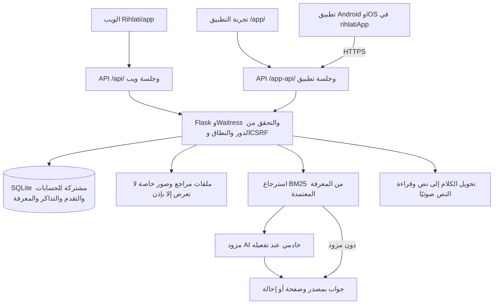
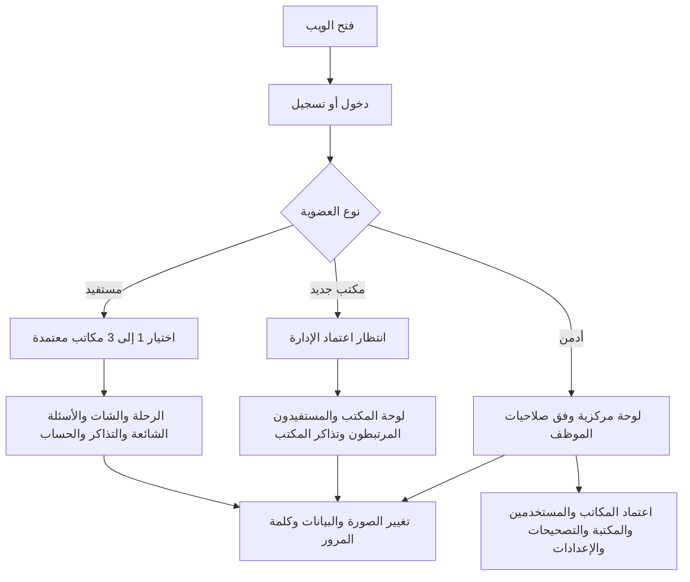
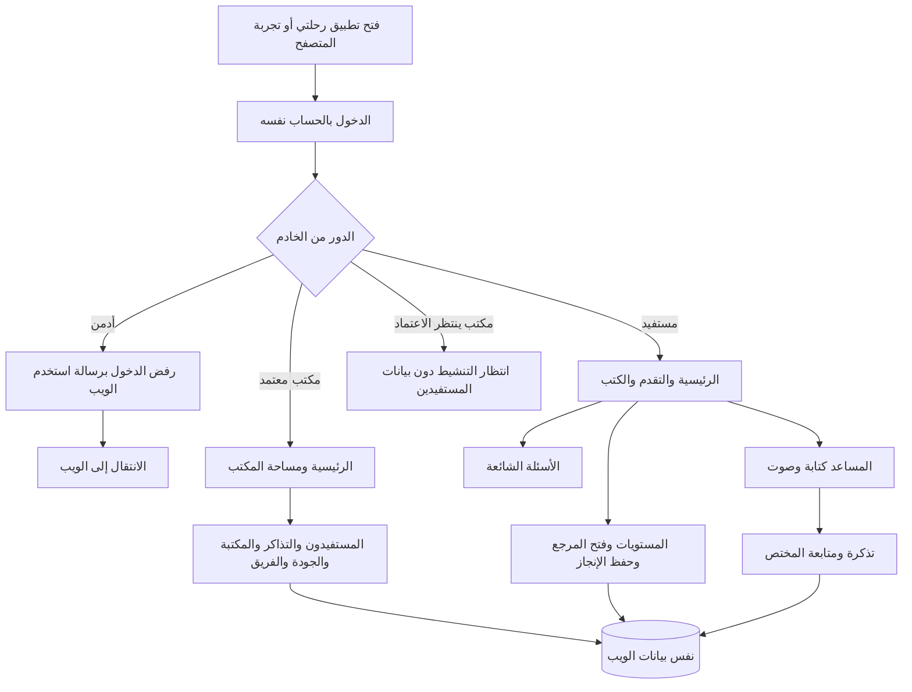
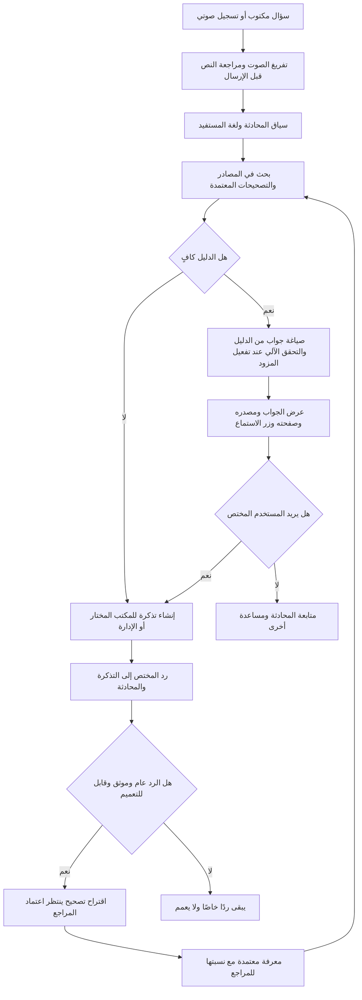
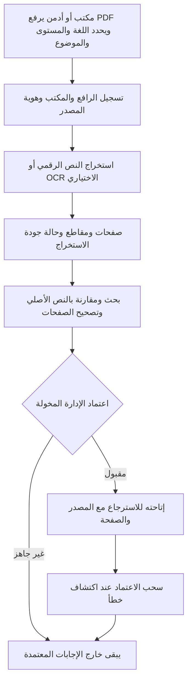

# فلوشارت رِحلتي للويب والتطبيق

فريق سراج | مراجعة 4 أكتوبر 2026. المسارات نسبية إلى جذر المستودع، وليست امتدادات جهاز المطور. هذه المخططات تصف التنفيذ الحالي، ولا تعني اكتمال النشر أو اعتماد المخرجات شرعيًا. أصل الفكرة: `Rihlati/docs/idea.docx`.

## المكونات المشتركة

## دخول الويب والصلاحيات

## دخول التطبيق ورحلة المستفيد

## السؤال والجواب والمختص

التحقق الآلي يقلل الأخطاء ولا يمثل اعتمادًا شرعيًا. التعلّم هنا إضافة معرفة مصححة معتمدة للاسترجاع، وليس تدريبًا تلقائيًا لأوزان النموذج. لا تدخل إجابة مولّدة غير مراجعة إلى المعرفة الموثوقة.

## إضافة مرجع ومراجعته

الاعتماد التقني في قاعدة البيانات ليس إثبات حقوق النشر أو شهادة مراجعة شرعية خارجية. يجب توثيق الجهة والمؤلف والطبعة وإذن الإتاحة قبل النشر العام، مع الانتباه لاختلاف رقم صفحة PDF عن ترقيم الكتاب.

## الأدوات والتحكم

| الجزء | الأداة الحالية | الوظيفة والحدود |
| --- | --- | --- |
| واجهات الويب والهاتف | HTML وCSS وJavaScript | ست لغات واتجاه RTL وواجهة هاتف خاصة |
| تغليف الهاتف | Capacitor 8 | Android وiOS وتكامل الرجوع والكيبورد والاهتزاز |
| الخادم | Python وFlask وWaitress | التحقق من المستخدم والنطاق والصلاحيات |
| قاعدة البيانات | SQLite | حسابات وتذاكر وتقدم وصفحات ومقاطع على خادم واحد |
| كلمات المرور | Argon2id | تجزئة بملح عشوائي، ليست تشفيرًا قابلًا للفك |
| الاسترجاع | BM25 | بحث نصي، ليس قاعدة متجهات |
| المساعد والصوت | مزود OpenAI عبر الخادم | يحتاج مفتاحًا ورصيدًا وضبط خصوصية وتقييمًا فعليًا |
| الكتب | pypdf وPDF.js | استخراج على الخادم وقراءة داخل التطبيق |
| OCR الاختياري | Tesseract.js وPoppler | يحتاج لغات مدربة ومراجعة للصفحات الضعيفة |

## مصفوفة الوصول

| الوظيفة | المستفيد | المكتب | الأدمن عبر الويب |
| --- | --- | --- | --- |
| الرحلة والشات والتذاكر الشخصية | حسابه فقط | بحسب حسابه ودوره | وفق الصلاحيات |
| متابعة المستفيدين | لا | المرتبطون بمكتبه فقط | وفق الصلاحيات |
| الرد على التذكرة | متابعة ردّه | تذاكر مكتبه فقط | وفق الصلاحيات |
| رفع المراجع واقتراح التصحيحات | لا | نعم ضمن نطاقه | نعم وفق الصلاحيات |
| اعتماد المعرفة وتفعيل المكاتب | لا | لا | صلاحية مخصصة |
| مفتاح الخدمة ومتطلبات التسجيل | لا | لا | صلاحية مخصصة |
| إدارة الإداريين | لا | لا | صلاحية مخصصة؛ الرئيسي محمي |
| دخول الإدارة من التطبيق | لا | لا | مرفوض من الخادم |

## ملفات مرجعية للمطور

الويب `Rihlati/app` والخادم `Rihlati/scripts/api_server.py` والحسابات `accounts.py` والمعرفة `knowledge.py` والمساعد `assistant_engine.py`. واجهة الهاتف `rihlatiApp/src` وبناؤها `rihlatiApp/scripts/build.mjs`. لا تعديل يدويًا في `www`. لا تُنسخ قاعدة حية إلى Git. تعليمات التشغيل والنشر في README ودليل DEPLOYMENT.
